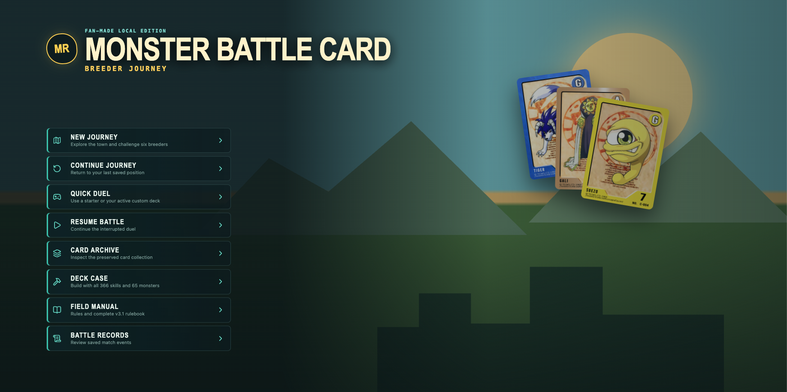
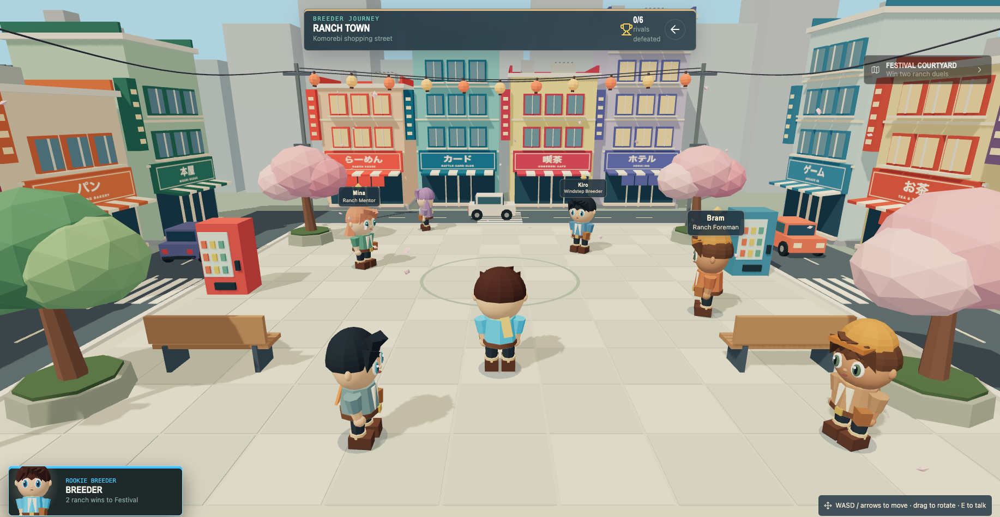
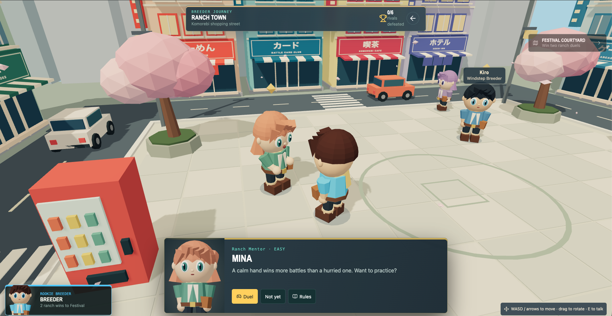
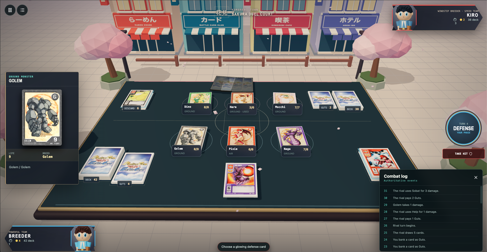

# Monster Battle Card — local restoration of Monster Rancher Battle Card

A private, offline, noncommercial fan remake of _Monster Farm Battle Card / Monster Rancher Battle Card_ (Game Boy). Built with React 19, TypeScript, Three.js / React Three Fiber, and an HTML HUD, bundled by vinext (Vite 8).

## Screenshots

| Title screen | Town exploration (Journey mode) |
| --- | --- |
|  |  |

| NPC duel challenge | Sakura Duel Court battle |
| --- | --- |
|  |  |

## Game modes

- **Journey** — 3D explorable town across two areas (Ranch Town's Komorebi shopping street and the Festival Courtyard). Talk to six NPCs, each with a difficulty tier (Mina and Kiro easy, Bram/Lyra/Rook normal, Veyra hard). The festival unlocks after two ranch wins; Veyra stays locked until Lyra and Rook are both beaten. Pick a starter deck and an outfit palette, with progress saved to IndexedDB.
- **Quick Duel** — play any starter or active custom deck against an AI opponent at easy, normal, or hard difficulty.
- **Resume Battle** — interrupted duels autosave and restore exactly where they left off.
- **Card Archive** — searchable visual archive of all 366 skills and 65 logical monsters.
- **Deck Case** — build and validate custom decks.
- **Field Manual** — rules reference plus the v3.1 rulebook PDF.
- **Battle Records** — completed-match archives and replays.

## Card and battle system

- All three official 50-card starters — Miracle Team (Tiger · Gali · Suezo), Speed Team (Dino · Hare · Mocchi), and Powerful Team (Golem · Pixie · Naga) — with 66 authored skill definitions and nine starter monsters.
- Three monsters per side with Life points; phase flow setup-guts → attack → defense → guts → gameover.
- Guts economy (card conversion, guts loss), ordered defenses, and KO/deck-out victory rules.
- Skill types POW/INT/SPE/DGE/BLK/ENV across ground/air/water attributes, a rich effect DSL (~35 effect kinds: combo, lifesteal, reflect, taunt, environment, attribute change, prevent-KO, …), and seven exceptional handlers (fusion, cocoon, emerge, take-over, resurrection, riddler, shadow-bind).
- Deterministic reducer with seeded xorshift shuffling, structured combat GameEvents, replay metadata, and save migration via `repairGameState`.

Cards outside the 66-card starter pool are intentionally visual-reference-only until their behavior is authored and tested. Deck validation rejects unknown or unimplemented skill definitions instead of allowing a silent no-op.

## AI

Easy, normal, and hard policies. Hard AI evaluates a shallow action beam and sampled hidden-card risk in a Web Worker using only `PlayerObservation` — it never peeks at hidden state.

## Tech stack

| Layer | Choice |
| --- | --- |
| Runtime | Node ≥ 22.13.0, pnpm, ESM |
| UI | React 19, Tailwind CSS 4, shadcn, Base UI, lucide-react |
| 3D | Three.js, React Three Fiber, drei |
| State/validation | Zod |
| Persistence | IndexedDB via idb (`mrbc-local-v1`: matches, replays, campaign) |
| Build | vinext (Vite 8), Cloudflare Workers (wrangler) for deploy |
| Quality | Vitest, oxlint, oxfmt, `tsc --noEmit` |

## Run it

Prerequisites: Node ≥ 22.13, pnpm, and a sibling asset archive — `../cards/` (459 validated PNGs: skills `001-366.png`, monsters `C-001..C-065`, card backs/token, plus the corrected `318.png` and the gallery-only `318-misprint.png`) and `../_MFBC_Rule-Book-v3.1.pdf`. Source files are never modified.

```bash
pnpm install
pnpm assets
pnpm dev
```

Open `http://localhost:3000`. The asset command validates the archive (739×1038 card dimensions) and creates cached WebP textures (420px scene / 739px detail) under `public/card-art/`, copies the rulebook into `public/docs/`, and writes `public/card-manifest.json`.

## Scripts

| Command | What it does |
| --- | --- |
| `pnpm assets` | Validate `../cards` + rulebook PDF, generate cached WebP art and manifest |
| `pnpm dev` | Dev server on `localhost:3000` |
| `pnpm build` | `pnpm assets` + production build |
| `pnpm start` | Serve the built Workers app locally via wrangler |
| `pnpm test` | Vitest suite (engine, battle director, world layout) |
| `pnpm lint` | oxlint |
| `pnpm format` | oxfmt |

One-off helpers in `scripts/` (manual): `import-full-catalog.mjs` (build `catalog.generated.json` from saved LegendCup HTML), `process-portraits.mjs` (NPC portrait background removal), `ocr-cards.swift` (macOS OCR helper).

## Project layout

```
app/            # File-based routes: / (title), /world, /play, /cards, /decks, /rules, /replays
components/     # game-client (duel HUD), tabletop (Three.js board), world-client,
                #   battle/ (arena, effects, duel director), world/ (scene, chibi, town), ui/
lib/game/       # types, engine reducer, cards/decks, ai + worker, campaign, world-layout,
                #   persistence, presentation, interaction, audio — with co-located tests
scripts/        # asset sync + catalog tooling
docs/           # art-direction notes
public/         # generated card-art, portraits, docs, card-manifest.json
```

## Verify

```bash
pnpm test
pnpm lint
pnpm exec tsc --noEmit
pnpm build
```

See [ATTRIBUTION.md](./ATTRIBUTION.md) for prototype scope and rights notes. This is a private fan project: all rights to the original game and its assets remain with their owners.
